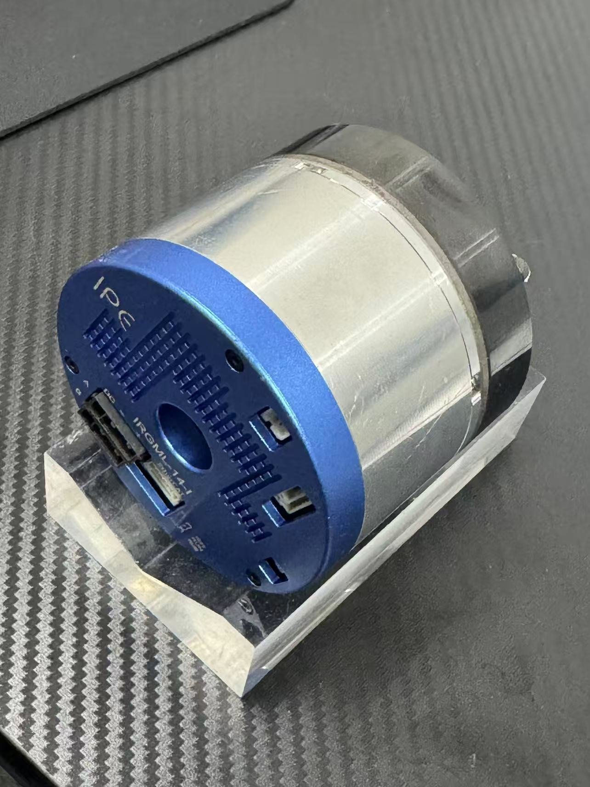

# IPE Single-Joint EtherCAT ROS 2 Control



A layered EtherCAT and ROS 2 control stack for the IPE IRGML-14-I integrated
rotary joint. The project connects application-level joint trajectories to a
CiA 402 drive through `ros2_control`, a closed-loop CST controller, and SOEM.

The repository also includes bounded CSP/CSV/CST commissioning tools, a mock
hardware backend, hardware identity checks, and operational documentation.

> **Project status:** hardware-tested engineering reference for one
> IRGML-14-I joint. It is not a safety-rated controller. Torque remains in
> drive-native `raw` units until the manufacturer conversion is verified.

## Why this project exists

Direct EtherCAT examples are useful for proving that a motor can move, but they
are difficult to integrate into a robot application. This project separates the
system into explicit layers:

```text
Application / planner
        |
        | trajectory_msgs/JointTrajectory
        v
Reference validation and interpolation
        |
        | position and velocity reference
        v
Real-time CST impedance controller
        |
        | torque_raw command
        v
ros2_control hardware interface
        |
        | CiA 402 + cyclic PDO
        v
SOEM EtherCAT master ----> IPE IRGML-14-I
```

Application code does not need to manage PDO layouts, control words, fault
resets, or Ethernet frames. Those responsibilities stay inside the hardware
layer.

## Capabilities

- Physical and mock `ros2_control` hardware backends with the same interfaces
- Application command API based on `trajectory_msgs/JointTrajectory`
- Closed-loop CST position/velocity impedance control
- Direct CSP, CSV, and CST commissioning in one persistent EtherCAT session
- CiA 402 enable, disable, mode switching, and explicit fault reset
- Slave vendor/product validation before motion is enabled
- WKC, EtherCAT state, PDO health, following-error, timeout, and command limits
- Joint-state, raw-velocity, raw-torque, and controller-status telemetry
- Hardware-free unit tests for conversion and control-law behavior

## Supported hardware

The checked-in configuration targets the bench-tested setup below.

| Item | Configured value |
| --- | --- |
| Joint | IPE IRGML-14-I integrated rotary joint |
| EtherCAT slave name | `CoE Drives` |
| Vendor ID | `0x00041101` |
| Product ID | `0x00009253` |
| Encoder | 18-bit absolute, 262,144 count per encoder revolution |
| Measured reduction ratio | Approximately 101:1 |
| Network interface | Configured per workstation in `.env` |
| ROS distribution | ROS 2 Jazzy |
| Host platform | Linux |

Do not assume that another reducer ratio, firmware revision, or PDO map is
compatible. Verify the device profile before enabling motion.

## Choose the correct operating path

| Goal | Entry point | Opens EtherCAT | Can move hardware |
| --- | --- | ---: | ---: |
| Develop ROS nodes and integration | Main launch with mock hardware | No | No |
| Run application trajectories | Main CST launch | Yes | After controller activation |
| Commission CSP/CSV/CST directly | `ipe_three_mode_lab` | Yes | Yes |
| Inspect/reset/hold a joint conservatively | `single_joint_lab` | Yes | Command dependent |
| Read state only | `single_joint_lab monitor` | Yes | No |

Exactly one process may own the EtherCAT interface. Never run the main launch,
the commissioning console, and a standalone tool at the same time.

## Repository structure

```text
.
├── ros2_ws/src/
│   ├── ipe_description/   Robot model and hardware selection
│   ├── ipe_controllers/   Real-time CST impedance controller
│   ├── ipe_control/       Trajectory validation and command utilities
│   └── ipe_bringup/       Launch and deployment parameters
├── ipe/                   EtherCAT core and ros2_control hardware plugins
├── adapter/               Persistent CSP/CSV/CST commissioning console
├── scripts/               Build, launch, capability, and repository checks
└── docs/                  Architecture, operation, safety, and hardware notes
```

See [Repository Structure and Ownership](docs/PROJECT_LAYOUT.md) for the
file-level map.

## New-computer setup

The repository contains every project source dependency required for the Linux
build, including SOEM. Build output and workstation settings are deliberately
regenerated on each computer.

```bash
git clone https://github.com/haomingyi/ipe-single-joint-ethercat-ros2-control.git
cd ipe-single-joint-ethercat-ros2-control
cp .env.example .env
```

Edit `.env` for the new computer:

```dotenv
IPE_ROS_DISTRO=jazzy
IPE_ROS_SETUP=/opt/ros/jazzy/setup.bash
IPE_INTERFACE=enp130s0
IPE_ZERO_COUNT=130336
IPE_DIRECTION=-1
IPE_VELOCITY_RAW_TO_RAD_S=2.3731138426448658e-7
```

Find the new network-interface name with `ip -brief link`; it does not need to
match the original workstation.

Install declared dependencies and validate the host:

```bash
./scripts/install_dependencies.sh
./scripts/check_system.sh
```

Then build and test:

```bash
./scripts/build_ros2_project.sh
./scripts/test_project.sh
```

Run the software-only system before connecting hardware:

```bash
./scripts/run_mock_project.sh
```

For physical operation, grant capabilities to the newly linked executable and
check the network link:

```bash
./scripts/setup_project_capability.sh
./scripts/check_system.sh --hardware
```

This sequence is the supported migration path. Never copy `build`, `install`,
or `log` directories from another computer.

## Prerequisites

- Ubuntu/Linux with ROS 2 Jazzy installed under `/opt/ros/jazzy`
- A C/C++ toolchain, CMake, Python 3, `colcon`, and pthread
- A dedicated wired Ethernet interface connected directly to the joint
- Permission to grant `CAP_NET_ADMIN`, `CAP_NET_RAW`, and scheduling capability
  to the project-owned EtherCAT executable
- A mechanically secured joint and an independent emergency power cut for
  physical tests

## Build only

```bash
./scripts/build_ros2_project.sh
```

The script builds the five ROS 2 packages into `ros2_ws/build` and
`ros2_ws/install`. Build output is intentionally excluded from Git.

After a physical-hardware executable is linked, grant capabilities once:

```bash
./scripts/setup_project_capability.sh
```

Re-run the capability script whenever that executable is rebuilt or replaced.
Capabilities are assigned to the project executable, not to the system-wide
`ros2` command.

## Quick start: mock hardware

Mock mode validates launch composition, controller switching, topics, and
application commands without opening the Ethernet interface.

Terminal 1:

```bash
./scripts/run_mock_project.sh
```

Terminal 2:

```bash
source scripts/project_env.sh
ipe_source_ros
ipe_source_workspace

ros2 control list_controllers
ros2 control switch_controllers \
  --activate ipe_cst_impedance_controller \
  --strict

ros2 run ipe_control send_joint_goal \
  --relative-degrees 5 \
  --seconds 5

ros2 topic echo /ipe_cst_impedance_controller/status --once

ros2 control switch_controllers \
  --deactivate ipe_cst_impedance_controller \
  --strict
```

Mock mode is a software integration backend, not a dynamics simulator. It does
not reproduce inertia, friction, reducer backlash, or physical CST response.

## Quick start: physical joint

Before power-on:

1. Secure the joint body.
2. Remove tools and loads from the flange.
3. Keep people outside the motion envelope.
4. Ensure cables cannot wind around the rotating axis.
5. Prepare an independent emergency power cut.
6. Confirm that no other EtherCAT master is running.

Start the complete hardware application in terminal 1:

```bash
./scripts/run_cst_project.sh
```

In terminal 2, load the environment and inspect the initial state:

```bash
source scripts/project_env.sh
ipe_source_ros
ipe_source_workspace

ros2 control list_hardware_components -v
ros2 control list_controllers
ros2 topic echo /joint_states --once
```

Expected before motion:

- hardware component: `active`
- `joint_state_broadcaster`: `active`
- every motion controller: `inactive`

Activate the application CST controller and send a small trajectory:

```bash
ros2 control switch_controllers \
  --activate ipe_cst_impedance_controller \
  --strict

ros2 run ipe_control send_joint_goal \
  --relative-degrees 5 \
  --seconds 5
```

Stop motion ownership before shutting down:

```bash
ros2 control switch_controllers \
  --deactivate ipe_cst_impedance_controller \
  --strict
```

Then press `Ctrl+C` in terminal 1. In an emergency, cut drive power immediately
instead of waiting for software shutdown.

The complete terminal workflow and expected output are documented in the
[Operations Guide](docs/OPERATIONS_GUIDE.md).

## Control modes and units

| Mode | CiA 402 value | Command | Typical role |
| --- | ---: | --- | --- |
| CSP | 8 | target position | Position commissioning and fallback |
| CSV | 9 | target velocity | Continuous-speed commissioning |
| CST | 10 | target torque | Main closed-loop control mode |

ROS-facing position and velocity use radians and radians per second. The
low-level drive also exposes:

- `count`: one encoder increment, not one motor or flange revolution
- `velocity_raw`: drive-native velocity quantity
- `torque_raw`: drive-native torque quantity

The configured 18-bit encoder has `2^18 = 262144` count per encoder revolution.
Do not interpret `torque_raw` as Nm until a verified conversion is available.

## Main runtime interfaces

| Interface | Type | Producer / consumer |
| --- | --- | --- |
| `/ipe/command` | `trajectory_msgs/JointTrajectory` | Application to reference manager |
| `/joint_states` | `sensor_msgs/JointState` | Hardware state to ROS consumers |
| `/ipe_cst_impedance_controller/reference` | `sensor_msgs/JointState` | Reference manager to controller |
| `/ipe_cst_impedance_controller/status` | `sensor_msgs/JointState` | Controller diagnostics |
| `ipe_joint/position` | ros2_control state/command | CSP and state feedback |
| `ipe_joint/velocity_raw` | ros2_control state/command | CSV commissioning |
| `ipe_joint/torque_raw` | ros2_control state/command | CST control |

## Timing model

| Layer | Nominal rate |
| --- | ---: |
| EtherCAT PDO exchange | 1 kHz |
| ros2_control controller manager | 100 Hz |
| Trajectory reference manager | 50 Hz |

The slower ROS layers provide references and control updates; the EtherCAT
thread maintains deterministic cyclic process-data exchange with the drive.

## Commissioning tools

Build and start the persistent three-mode console:

```bash
cmake -S adapter -B adapter/build -DCMAKE_BUILD_TYPE=Release
cmake --build adapter/build -j
./scripts/run_three_mode_logged.sh
```

Build the conservative standalone tool:

```bash
cmake -S ipe -B ipe/build-safe -DCMAKE_BUILD_TYPE=Release
cmake --build ipe/build-safe \
  --target single_joint_lab ipe_joint_units_test \
  -j
ctest --test-dir ipe/build-safe --output-on-failure
```

These programs bypass the application controller and are intended for
commissioning and diagnosis. Read the [Commissioning Guide](adapter/README.md)
and [Single-Joint Learning Guide](ipe/IPE_LEARNING_GUIDE.md) first.

## Configuration

Workstation-specific configuration is stored in the ignored `.env` file copied
from `.env.example`. Project behavior is concentrated in:

- `ros2_ws/src/ipe_description/urdf/ipe_single_joint.urdf.xacro`: interface,
  zero count, direction, hardware backend, and hardware limits
- `ros2_ws/src/ipe_bringup/config/controllers.yaml`: controller rates, gains,
  command clamp, tracking-error limit, and reference timeout
- `ros2_ws/src/ipe_bringup/config/reference_manager.yaml`: reference publishing
  and topic configuration

Current gains and limits are bench starting values for one unloaded joint. They
are not validated parameters for a loaded robot.

## Validation

Run the complete non-hardware validation:

```bash
./scripts/test_project.sh
```

Hardware movement is never part of an unattended automated test.

## Known limitations

- The physical configuration is validated for one joint, not a multi-axis robot.
- The `torque_raw` to Nm conversion is not yet manufacturer-verified.
- Mock hardware validates software wiring but not motor dynamics.
- The first CSP motion edge uses a firmware-specific control-word transition.
- The current motion-edge implementation can introduce a short blocking write;
  replacing it with a nonblocking state machine is recommended for harder
  real-time requirements.
- This project does not implement a safety PLC, certified stop category, or
  safety-rated torque off.

## Documentation

- [Operations Guide](docs/OPERATIONS_GUIDE.md)
- [System Architecture](docs/ARCHITECTURE.md)
- [Project Workflow and Extension Points](docs/PROJECT_WORKFLOW.md)
- [Repository Structure and Ownership](docs/PROJECT_LAYOUT.md)
- [Hardware Profile](docs/hardware/DEVICE_PROFILE.md)
- [Safety Checklist](docs/SAFETY.md)
- [Migration and Reproducibility](docs/MIGRATION.md)
- [Contributing](CONTRIBUTING.md)

## Licensing and provenance

SOEM is vendored under `ipe/SOEM/` with its upstream license. Repository-wide
licensing and provenance boundaries are described in [NOTICE.md](NOTICE.md).
Manufacturer documents, private device captures, runtime logs, build output,
and historical internal sources are not part of this repository.
